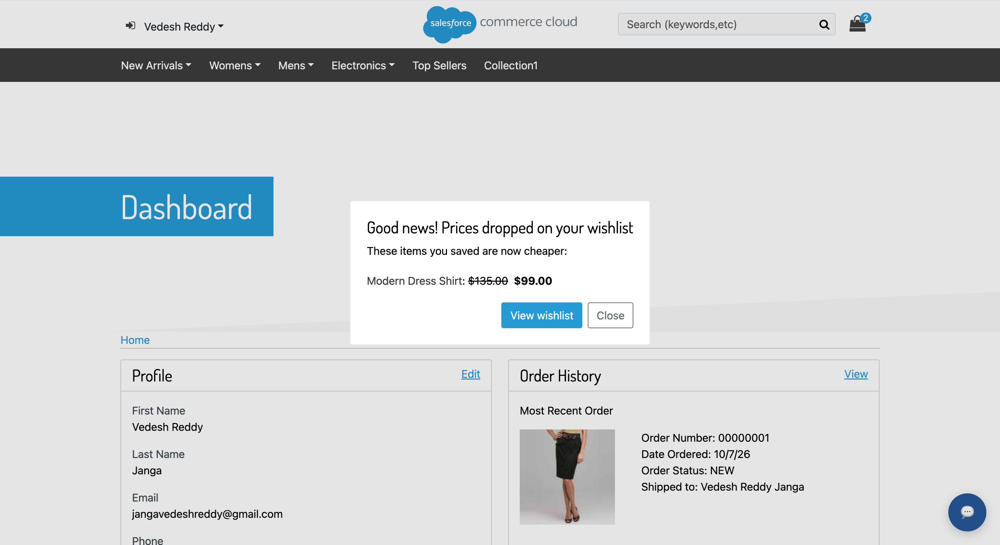
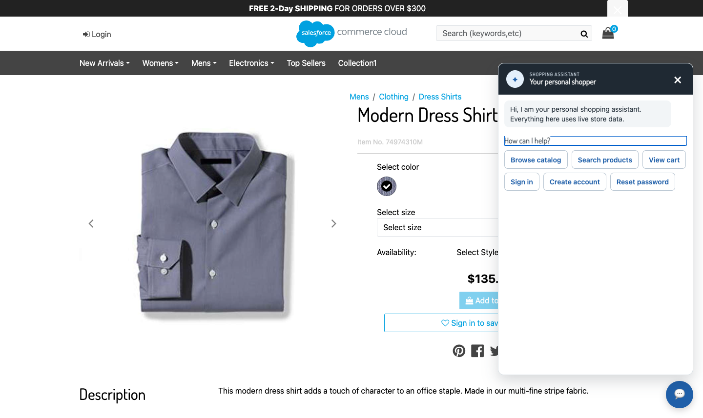
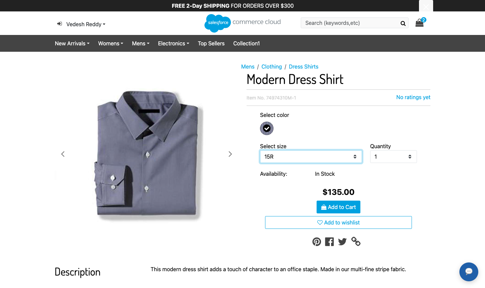
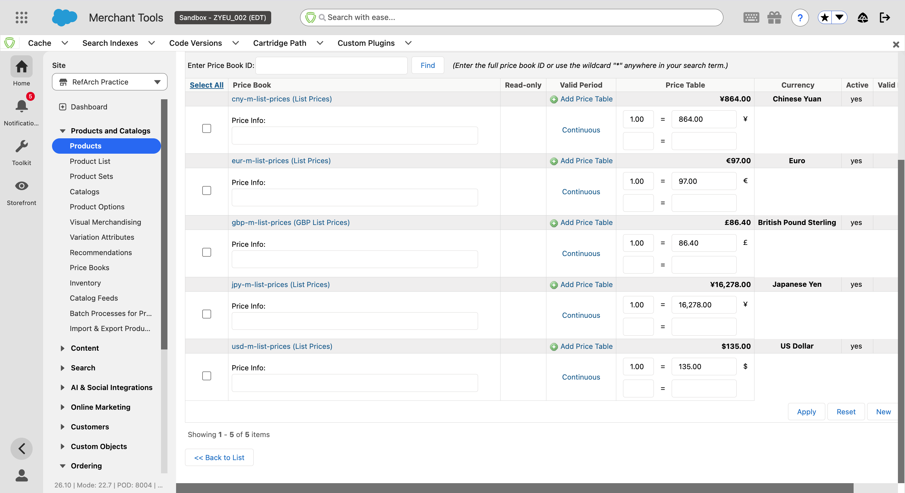
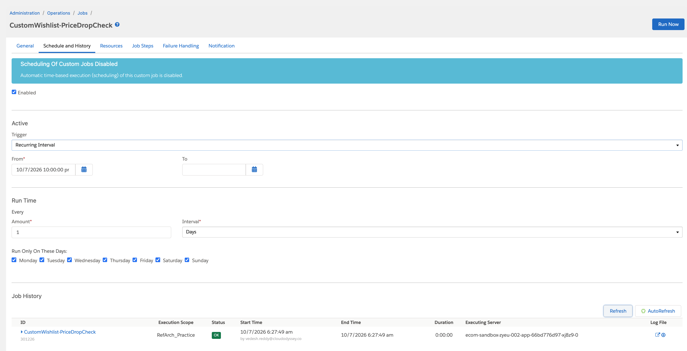
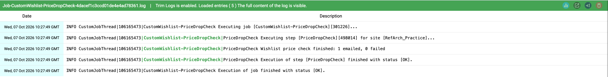

<div align="center">

# Custom Wishlist for SFRA

**Save products, watch the price books, tell shoppers when prices drop.**

[Setup](#installation) · [Walkthrough](#walkthrough-with-sandbox-screenshots) · [How it works](#how-it-works) · [Standalone repository](https://github.com/Vedesh-reddy/sfcc-custom-wishlist)

</div>



An SFRA overlay that adds a wishlist with price-drop alerts. Signed-in shoppers save
products from the product page. A scheduled job compares each saved item's current
price-book price with the price when it was added. When the price falls, the shopper
gets one email, and a popup the next time they sign in.

It uses the repository's root `package.json`, build configuration, and `dw.json`.

## Behavior

- Guests see **Sign in to save to wishlist**. Signed-in shoppers see **Add to wishlist**.
- The saved product is the variant the shopper selected. If no variant is selected,
  the master is saved and priced at its lowest variant price, as on the product page.
- Re-adding a saved product keeps the original added price.
- Prices come from the applicable price books (`product.priceModel.price`). Promotions are ignored.
- Each lower price is reported once. The next alert needs a price below the last one reported.
- Items whose current price is in a different currency from the saved price are skipped.
- One email per shopper per job run lists every dropped item.
- The popup appears on the first page after each sign-in, only for drops not shown yet.
- The button and popup are uncached remote includes, so CSRF tokens and shopper data
  stay out of cached pages.

## Installation

1. **Build.** Run `npm run compile:js` from the repository root.
   It compiles `client/default/js/customWishlist.js` into `cartridge/static`.
2. **Upload.** Run `npm run uploadCartridge`, which includes `plugin_customwishlist`,
   and activate the code version if necessary.
3. **Cartridge path.** In **Administration → Sites → Manage Sites → your site → Settings**,
   put `plugin_customwishlist` before `app_storefront_base`:

   ```text
   plugin_customwishlist:plugin_chatwidget:plugin_productreviews:app_storefront_base
   ```

   Set the path before importing the job. The job step type is registered from
   `steptypes.json` in cartridges on the site's path.
4. **Metadata.** Change `site-id` in `metadata/custom-wishlist/jobs.xml` to your site ID
   (the sandbox uses `RefArch_Practice`), then zip and import it through
   **Administration → Site Development → Site Import & Export**:

   ```sh
   cd metadata
   zip -r /tmp/custom-wishlist.zip custom-wishlist
   ```

   | File | Imports |
   | --- | --- |
   | `meta/system-objecttype-extensions.xml` | `ProductListItem` attributes `wishlistAddedPrice`, `wishlistPriceCurrency`, `wishlistLastNotifiedPrice`, `wishlistPriceAlertPending` |
   | `jobs.xml` | Job `CustomWishlist-PriceDropCheck`, daily at 02:00 UTC, step `custom.CustomWishlist.PriceDropCheck` |

5. **Email sender.** Set the `customerServiceEmail` site preference.

## Walkthrough with sandbox screenshots

Captured on sandbox `zyeu-002`, site `RefArch_Practice`, on October 7, 2026.

### 1. Guest sees the sign-in button



### 2. Signed-in shopper selects a variant and adds it

Size 15R selects variant `74974310M-1` at $135.00.



### 3. The wishlist stores the added price


### 4. Merchant lowers the price-book price

**Merchant Tools → Products and Catalogs → Products → 74974310M-1 → Pricing.**
The `usd-m-list-prices` price book holds $135.00:



The price is changed to $99.00 and applied:


### 5. The job runs

**Administration → Operations → Jobs → CustomWishlist-PriceDropCheck → Run Now.**
On sandboxes, scheduling of custom jobs is disabled, so the job is run manually.



The job log reports one shopper emailed and no failures:



### 6. The shopper gets an email


### 7. The popup appears after signing in again


### 8. The wishlist marks the drop


## How it works

| Piece | Where |
| --- | --- |
| Storage | Native customer wish list (`dw.customer.ProductList`, `TYPE_WISH_LIST`) plus the four `ProductListItem` attributes |
| Product page button | Overrides the empty base extension point `product/components/addToCartButtonExtension.isml` with a remote include of `CustomWishlist-Button` |
| Wishlist page | `CustomWishlist-Show`, with `CustomWishlist-Add` and `CustomWishlist-Remove` form posts (HTTPS and CSRF) |
| Job | `scripts/jobs/priceDropCheck.js`, registered in `steptypes.json` |
| Popup | The `app.template.afterFooter` hook remote-includes `CustomWishlist-Alert`, which checks once per signed-in session |
| Logs | `custom-wishlist` log file, categories `wishlist-storefront` and `price-drop-job` |

The job commits the popup flag before sending the email. If mail fails, the popup
still shows and the same drop is never emailed twice.

## Tests

```sh
npx mocha test/unit/plugin_customwishlist/
```

Six tests cover drop detection, repeat suppression, currency, offline and unpriced
products, the master price fallback, mail failure, and profiles without an email.
