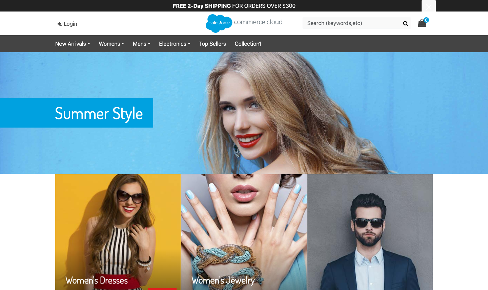
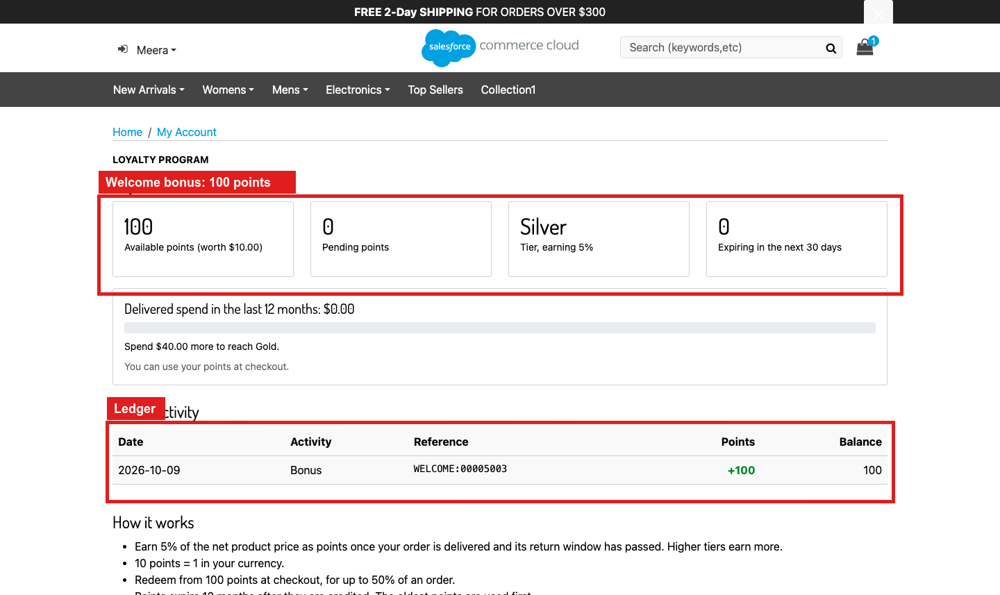
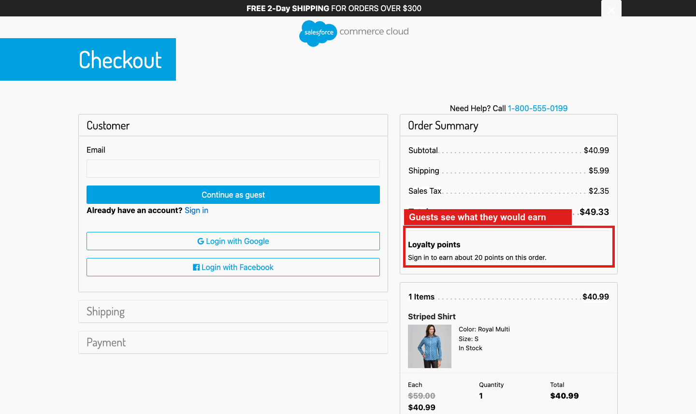
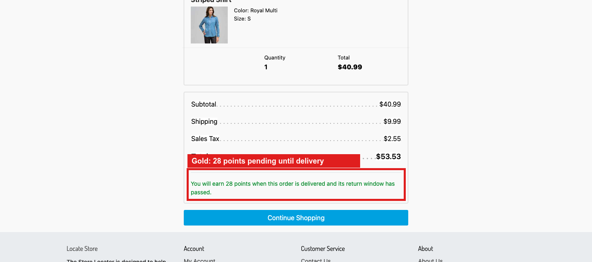
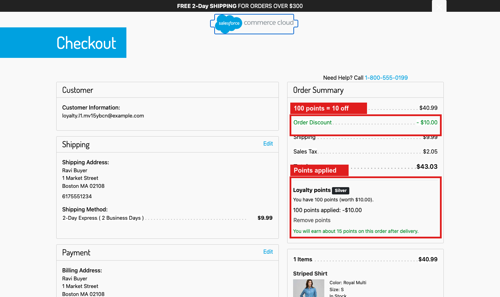
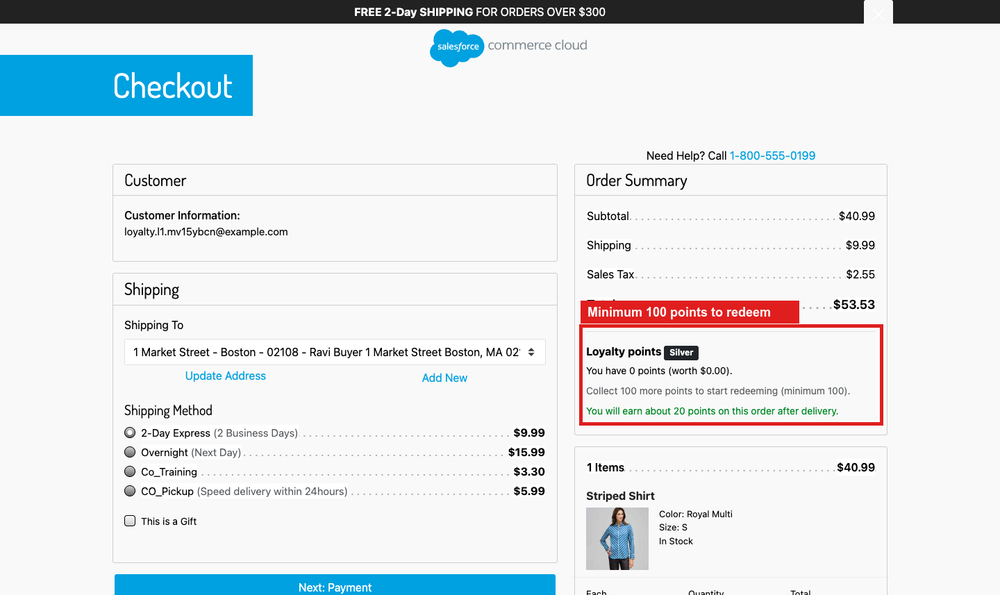

# plugin_loyalty — Loyalty Program

**Points, tiers and bonuses for SFRA.** Every delivered order earns 5% of its net product price back as points. 10 points are worth 1 in the shopper's currency, and points can be redeemed at checkout from a 100-point balance.

Screenshots were captured on sandbox `zyeu-002`, site `RefArch_Practice`, on October 9, 2026, against the deployed cartridge. The orders (00000307–00000311) are real SFCC orders and every number comes from the live ledger. Red boxes mark what the cartridge adds.

| # | Feature | Shopper entry point | Data | Job |
| --- | --- | --- | --- | --- |
| 1 | [My Points page](#1-my-points-page) | Footer link, `Loyalty-Show` | `LoyaltyAccount`, `LoyaltyLedger` | — |
| 2 | [Earning points](#2-earning-points) | Checkout, order confirmation | `LoyaltyOrder` | `Loyalty-ProcessOrders` |
| 3 | [Redeeming points](#3-redeeming-points) | Checkout panel | Basket and order attributes, `LoyaltyLot` | — |
| 4 | [Cancellations and refunds](#4-cancellations-and-refunds) | — | `LoyaltyOrder`, `LoyaltyLedger` | `Loyalty-ProcessOrders` |
| 5 | [Tiers](#5-tiers) | My Points, checkout | `LoyaltyAccount` | Both jobs |
| 6 | [Bonus points](#6-bonus-points) | — | `LoyaltyLot` | `Loyalty-Maintain` |
| 7 | [Expiry and reminders](#7-expiry-and-reminders) | Email | `LoyaltyLot` | `Loyalty-Maintain` |

---

### 1. My Points page

**What it does.** A footer link opens **My Points**.

1. The footer link:

   

2. Signed out, the page explains the program and tiers. Sign-in returns here (login slot `rurl=5`).

   

3. The first visit opens the account with a 100-point welcome bonus. The page shows balance and value, pending points, tier, points expiring soon, progress to the next tier, and the ledger.

   

---

### 2. Earning points

**What it does.** A placed order records *pending* points. They become *available* once the order is paid, delivered (the order or every shipment is Shipped), and past `LoyaltyReturnWindowDays` (7; the screenshots used 0).

1. Checkout shows what the order will earn. Guests see the points they would earn by signing in.

   

2. The order confirmation repeats it. This Gold member earns 7% of $40.99, which is 28 points.

   

**Rules**

- Points = net product price × tier rate × 10, rounded down. The base is after every discount, including points, and excludes shipping and tax. So $100 at 5% gives 50 points, worth $5.
- The rate is fixed by the tier when the order is placed.
- Returned items (non-cancelled return cases) are left out when points are released.
- Guests earn nothing.

---

### 3. Redeeming points

**What it does.** A panel under the checkout totals turns points into an order discount (10 points = 1).

1. The panel shows the balance, how many points this order can use, and the points to earn.

   

2. Applying 100 points adds a −$10.00 **Order Discount**. The order earns on the reduced price (15 points instead of 20).

   

3. Below the 100-point minimum, the panel says how many more are needed.

   

4. Points can pay at most `LoyaltyMaxRedeemPercent` (50%) of an order: with 420 points on a $40.99 order, at most 204.

   

**How it works**

- **Applying points:** `Loyalty-Apply` stores the requested points on the basket. The `basketCalculationHelpers` wrapper turns them into a custom order price adjustment (`loyalty-points`), always within the minimum, the balance and the cap.
- **Reserving points:** the `checkoutHelpers.createOrder` wrapper takes the points from the balance when the order is created, consuming the soonest-expiring lots first. If the balance was spent elsewhere in the meantime, the order is failed instead of discounted, and `CheckoutServices-PlaceOrder` warns the shopper first.
- **Failed payment:** if payment authorization or placement fails, the points are returned at once. The order job catches any other failed order.

---

### 4. Cancellations and refunds

Order 00000308 used 100 points and was then cancelled in Business Manager. The order job:
- returned the 100 points to the lots they came from, keeping their original expiry;
- dropped the order's pending points.

The ledger shows every movement with the balance after it:

---

### 5. Tiers

| Tier | Delivered spend in 12 months | Earn rate |
| --- | --- | --- |
| Silver | 0 | 5% |
| Gold | `LoyaltyGoldThreshold` (1,000; the screenshots used 40) | 7% |
| Platinum | `LoyaltyPlatinumThreshold` (2,500; the screenshots used 500) | 10% |

The tier is re-evaluated when an order's points are released. The daily job also re-evaluates it, so customers drop a tier when old orders leave the 12-month window. Above, delivering order 00000307 ($40.99) moved the member to Gold.

---

### 6. Bonus points

| Bonus | Default | When |
| --- | --- | --- |
| Welcome | 100 | The loyalty account is opened |
| Birthday | 200 | On the profile birthday, once a year (daily job) |
| Completed profile | 50 | Name, phone, birthday and an address are present (daily job) |
| Approved review | 50 | A `plugin_productreviews` review is approved (daily job; skipped when that cartridge is not installed) |

Each bonus is a lot whose key is the bonus itself (`BIRTHDAY:<customer>:<year>`, `REVIEW:<review>`), so it can never be credited twice.

---

### 7. Expiry and reminders

- Points expire `LoyaltyExpiryMonths` (12) after they are credited. Redemption uses the oldest points first.
- The daily job expires lots and sends one reminder per customer `LoyaltyExpiryReminderDays` (30) before points expire.

This path is covered by unit tests, not screenshots.

---

## Data integrity

- **Ledger:** every balance change writes an immutable `LoyaltyLedger` entry keyed `customerNo:sequence`. Two concurrent writers for one customer collide on that key and one rolls back, so balances are never lost or double-spent.
- **Invariant:** the account balance equals the sum of open lots. The unit tests assert it after every scenario.
- **Idempotent credits:** each credit's lot key is its source (`ORDER:<no>`, a bonus key), so job retries never double-credit.

## Installation

1. Cartridge path, leftmost:
   `plugin_loyalty:plugin_affiliateproduct:plugin_socialgifting:plugin_smartcommerce:plugin_customwishlist:plugin_chatwidget:plugin_productreviews:app_storefront_base`
2. Build and upload: `npm run compile:js`, then `npx sgmf-scripts --uploadCartridge plugin_loyalty`.
3. Zip `metadata/loyalty-program` and import it in **Administration > Site Development > Site Import & Export**. It contains the four custom object types, Basket and Order attributes, the **Loyalty Program** site preferences, the two jobs, and `LoyaltyEnabled = true` for `RefArch_Practice`.
4. Add `<li><a href="$url('Loyalty-Show')$">My Points</a></li>` to the `footer-account` content asset.
5. Schedule `Loyalty-ProcessOrders` every 30 minutes and `Loyalty-Maintain` daily.

`checkout/orderTotalSummary.isml` is an SFRA copy with one include added. It renders the checkout panel only when `Checkout-Begin` sets `loyaltyCheckout`, and the confirmation note only when `Order-Confirm` sets `loyaltyConfirmation`.

## Site preferences (Loyalty Program group)

| Preference | Default |
| --- | --- |
| `LoyaltyEnabled` | false (true in the site archive) |
| `LoyaltyPointsPerCurrencyUnit` | 10 |
| `LoyaltyMinRedeemPoints` | 100 |
| `LoyaltyMaxRedeemPercent` | 50 |
| `LoyaltyEarnPercentSilver` / `Gold` / `Platinum` | 5 / 7 / 10 |
| `LoyaltyGoldThreshold` / `LoyaltyPlatinumThreshold` | 1000 / 2500 |
| `LoyaltyReturnWindowDays` | 7 |
| `LoyaltyExpiryMonths` | 12 |
| `LoyaltyExpiryReminderDays` | 30 |
| `LoyaltyWelcomeBonus` / `Birthday` / `Profile` / `Review` | 100 / 200 / 50 / 50 |

## Data model

| Custom object | Key | Purpose |
| --- | --- | --- |
| `LoyaltyAccount` | customer number | Balance, pending points, tier, rolling spend, ledger sequence |
| `LoyaltyLedger` | `customerNo:sequence` | Immutable movement: EARN, BONUS, REDEEM, REFUND, EXPIRE |
| `LoyaltyLot` | credit source | Points credited together, remaining and expiry |
| `LoyaltyOrder` | order number | Redeemed lots, pending and earned points, status and wait reason |

## Logging

`Logger.getLogger('loyalty-program', <category>)` with categories `loyalty-redemption`, `loyalty-orders`, `loyalty-maintenance` and `loyalty-bonus`.

## Tests

`npm run test:loyalty` runs 18 unit tests:

- **Earning rules:** earn maths, tiers, redemption limits.
- **Ledger:** welcome bonus once, idempotent credits, FIFO redemption, insufficient-balance rollback, ledger-key serialization, expiry.
- **Checkout:** the discount within the cap, guests, reservation and a single refund.
- **Orders:** the pending → available lifecycle per shipment, cancellation refunds, returns (ignoring cancelled ones), tier upgrade.
- **Maintenance job:** expiry, reminders, birthday and profile bonuses.

## Not built yet

- Manual point adjustments by staff.
- Clawback of points already released when items are returned after the return window.
- Tier perks beyond the earn rate.
- A card on the account page (`account/dashboardProfileCards` is overridden by plugin_socialgifting).
