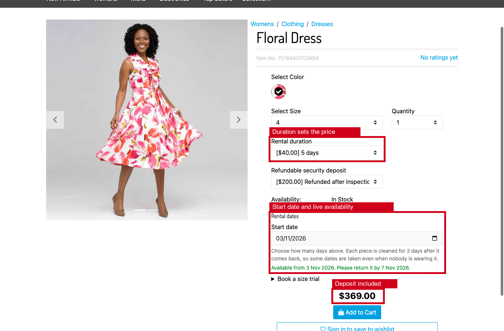
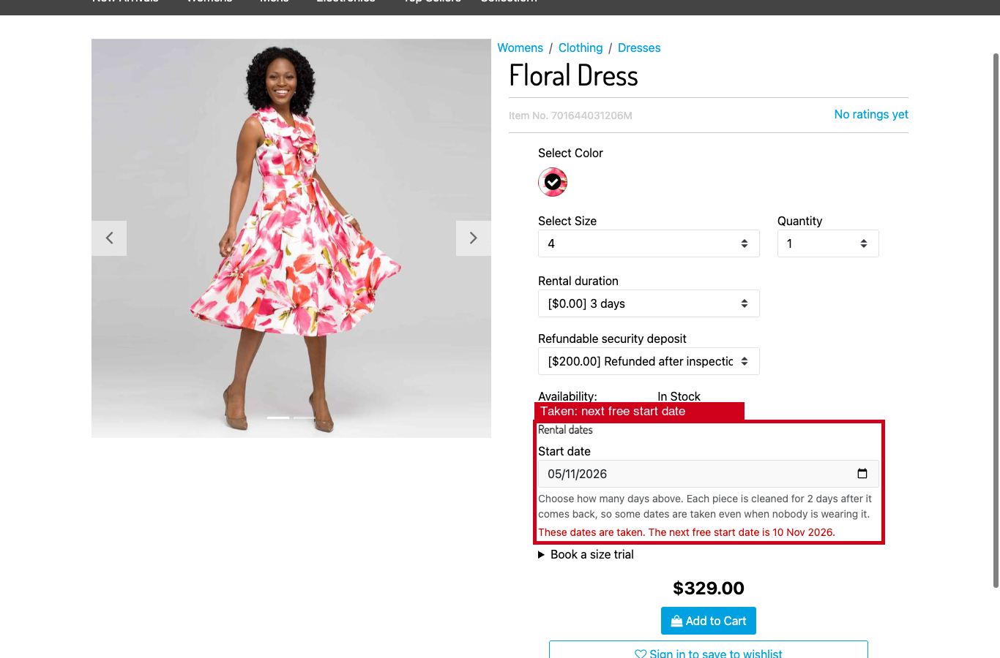
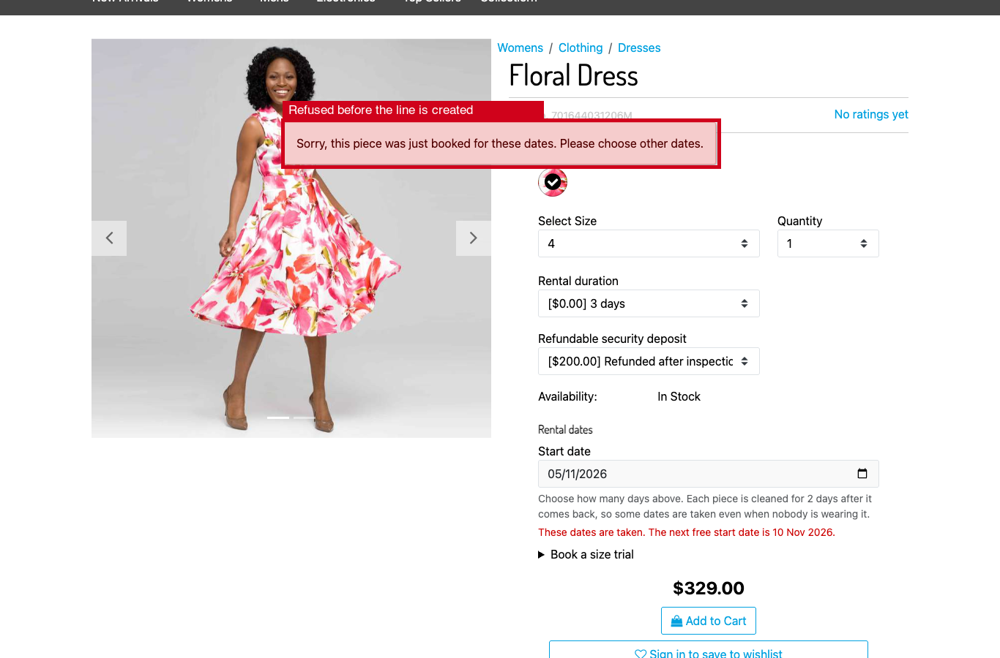
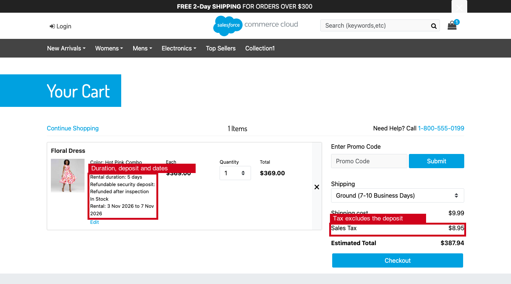
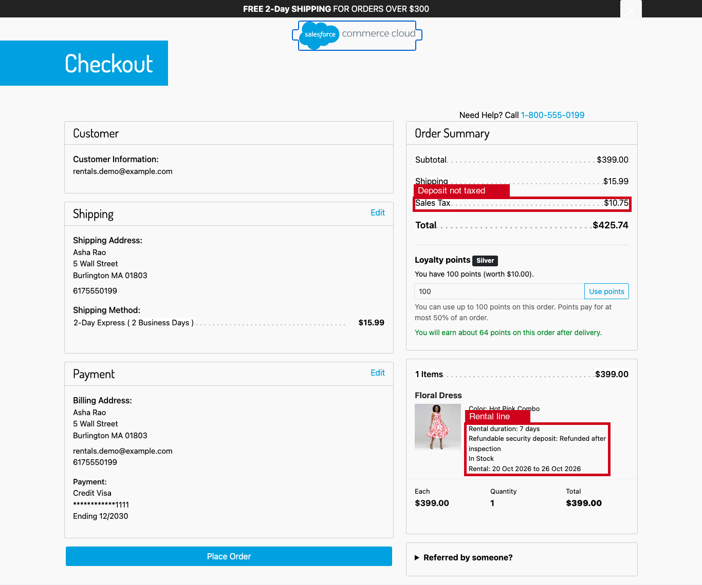
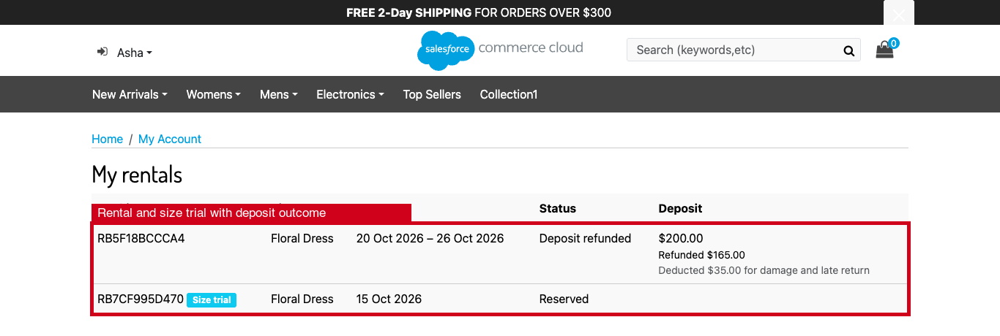
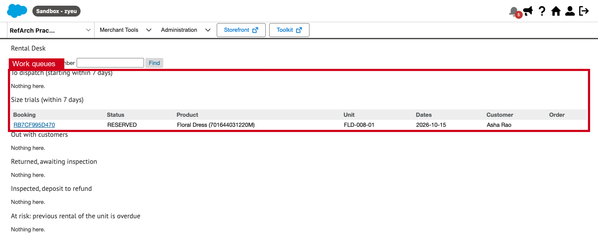
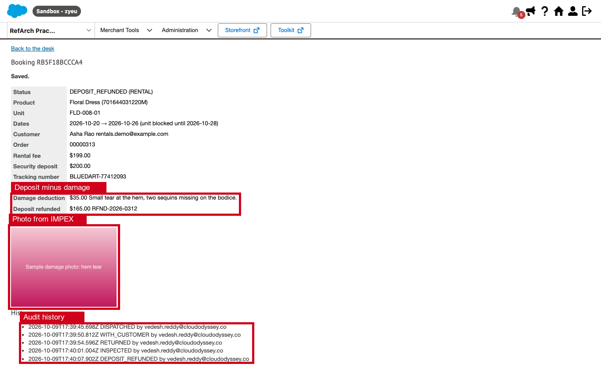

# plugin_rentals

Rent wedding lehengas, sherwanis and jewellery sets for 3, 5 or 7 days on an SFRA storefront.

- **Unit-level calendars.** Each physical piece has its own calendar. Cleaning and return-transit days are blocked after every rental.
- **Booking on the product page.** The shopper picks a start date, the duration sets the price, a refundable security deposit is added, and a size trial can be booked.
- **Lifecycle.** HELD (in the cart) → RESERVED → DISPATCHED → WITH_CUSTOMER → RETURNED → INSPECTED → DEPOSIT_REFUNDED. The refund is the deposit minus damage and late fee.
- **Business Manager desk.** Dispatch and return queues, damage inspection with photos, deposit refunds, and two jobs: one releases holds, the other charges late fees.

## Why a reservation engine

SFCC inventory counts pieces. It cannot say that unit LEH-RED-M-01 is out from 10 to 14 November and being cleaned on the 15th and 16th. This cartridge keeps the calendar in custom objects and leaves platform inventory alone.

| Custom object | Key | Purpose |
|---|---|---|
| `RentalUnit` | unit tag, e.g. `LEH-RED-M-01` | One physical piece: its variant (so its size), and its status: `ACTIVE`, `MAINTENANCE` or `RETIRED` |
| `RentalUnitDay` | `unit|yyyy-MM-dd` | One blocked day of one unit |
| `RentalBooking` | `RB…` | One rental or size trial and its lifecycle |

**Concurrency control is the unique key of `RentalUnitDay`.** A claim creates every blocked day (the rental days plus `RentalBufferDays`) in one transaction. If two shoppers commit the same day at the same moment, the database rejects the second claim and its whole transaction rolls back. The engine then tries the next unit of the same size. The availability check that runs first is only a fast path; correctness never depends on it. This is covered by a unit test that hides the first claim from the second request's availability read.

**Cart holds.** Adding a rental to the bag claims a unit before the line is created, with an expiry of `RentalHoldMinutes`. An expired hold no longer blocks anybody: the next claim deletes it (it is re-read inside its own transaction, so a day another shopper has just claimed is never deleted) and then claims the day through the unique key as usual. `Rentals-ReleaseHolds` cleans up whatever nobody reclaimed. `CheckoutServices-PlaceOrder` renews every hold and stops checkout if a line lost its days. A successful `placeOrder` makes the days permanent.

## Setup

1. **Cartridge path.** Storefront: `plugin_rentals:` before the other plugins and `app_storefront_base`. Business Manager: add `plugin_rentals` to the BM cartridge path for the desk.
2. **Metadata.** Import `metadata/rentals` as a site archive. It adds the custom objects, `Product.rentalEnabled`, two `ProductLineItem` attributes, the site preferences (group *Rentals*) and the two jobs.
3. **Preferences** (*Merchant Tools > Site Preferences > Custom Preferences > Rentals*):

   | Preference | Default | Meaning |
   |---|---|---|
   | `RentalsEnabled` | false | Master switch |
   | `RentalLeadDays` | 3 | Earliest start, counted from today (dispatch time) |
   | `RentalHorizonDays` | 180 | Latest start |
   | `RentalBufferDays` | 2 | Cleaning and return-transit days blocked after each rental |
   | `RentalHoldMinutes` | 30 | How long a piece stays held in the bag |
   | `RentalLateFeePerDay` | 500 | Late fee per day, deducted from the deposit |

4. **Products.** Set `rentalEnabled` on the master; variants inherit it. Give every rental product two catalog options. Pricing then stays native: the PDP shows the price per duration, promotions see it, and the cart shows both options.
   - `rentalDuration`: one value per duration. The value ID is the number of days (`3`, `5`, `7`) and its price is the surcharge over the price-book price.
   - `rentalDeposit`: a single value priced at the deposit. The cartridge moves this line to the tax-exempt tax class, because a refundable deposit is not a sale.

   ```xml
   <options>
       <option option-id="rentalDuration">
           <display-name xml:lang="x-default">Rental duration</display-name>
           <sort-mode>position</sort-mode>
           <option-values>
               <option-value value-id="3" default="true">
                   <display-value xml:lang="x-default">3 days</display-value>
                   <option-value-prices><option-value-price currency="INR">0</option-value-price></option-value-prices>
               </option-value>
               <option-value value-id="5" default="false">
                   <display-value xml:lang="x-default">5 days</display-value>
                   <option-value-prices><option-value-price currency="INR">3000</option-value-price></option-value-prices>
               </option-value>
               <option-value value-id="7" default="false">
                   <display-value xml:lang="x-default">7 days</display-value>
                   <option-value-prices><option-value-price currency="INR">5500</option-value-price></option-value-prices>
               </option-value>
           </option-values>
       </option>
       <option option-id="rentalDeposit">
           <display-name xml:lang="x-default">Refundable security deposit</display-name>
           <option-values>
               <option-value value-id="standard" default="true">
                   <display-value xml:lang="x-default">Refunded after inspection</display-value>
                   <option-value-prices><option-value-price currency="INR">15000</option-value-price></option-value-prices>
               </option-value>
           </option-values>
       </option>
   </options>
   ```

5. **Inventory.** Mark rental variants *perpetual* in the inventory list. Availability comes from the calendar, so platform stock must never be what stops a rental.
6. **Units.** Create one `RentalUnit` per physical piece (*Merchant Tools > Custom Objects*). Set `productID` to the variant ID and `status` to `ACTIVE`.
7. **Desk permission.** Grant the *Rentals > Rental Desk* module to the roles that run the desk.
8. **Jobs.** Schedule `Rentals-ReleaseHolds` every 15 minutes and `Rentals-LateFees` daily.

## Storefront

The screenshots are from sandbox zyeu-002, site RefArch_Practice, using the demo Floral Dress (`25592581M`) with four units.

### Picking dates on the product page

`product/components/productAvailability.isml` is overridden to add an uncached remote include (`Rental-Panel`). It sits outside `product-options`, because SFRA re-renders that block from the variation response, where a remote include cannot run.

The panel holds a native date input. When the date, size or duration changes, `Rental-Quote` replies. The duration option sets the price, and the deposit option is added on top.



When the dates are taken, the quote names the first start date on which a unit is back and cleaned.



### Holding the piece in the bag

`Cart-AddProduct` claims the unit before the base route adds the line, using the posted duration option. The platform refuses to add and remove a line in the same request (`api.basket.addRemoveInSameRequest`), so a refused claim has to stop the request before the line exists. After the base route, the hold is attached to the new line.


A second shopper who tries the same dates on the same unit is refused, even if their page still showed the dates as free.



### Cart and checkout

Cart, checkout and order pages show the rental dates next to the two options. Each rental is for exactly one piece, and dates or duration cannot be edited in the cart: the shopper removes the line and adds it again, which releases the hold. The deposit line is tax-exempt, so tax is charged on the rental fee and shipping only.





### Size trial

A logged-in shopper books one studio day to try the size, with no cleaning buffer. At most two trials can be active per shopper.


### My rentals

`Rental-Bookings` lists the shopper's bookings with status, deposit, deductions and refund.



## Business Manager

*Merchant Tools > Rentals > Rental Desk*

### Queues

The desk lists:
- bookings to dispatch within 7 days
- size trials
- rentals out with customers (overdue ones are flagged)
- returns awaiting inspection
- deposits to refund
- bookings at risk

It can also look up a booking by booking or order number.



### Booking lifecycle

The booking page shows only the actions the current status allows:
- **Dispatch**, which needs a tracking number.
- **Delivered**.
- **Return received**, which fixes the late fee.
- **Damage inspection**.
- **Refund deposit**, which records the refund reference.
- **Cancel**, which frees the dates.

Every action is appended to the booking's history with the BM user's name.


### Damage inspection

The inspection records a deduction of at most the deposit, notes, up to four photos (JPEG, PNG or WebP, 2 MB each), and optionally sends the unit to maintenance. Photos are stored under `IMPEX/src/rentals/<booking>/` with names generated by the server. The desk shows them inline, so they never need a public URL. The form is multipart, so its CSRF token travels in the action URL.


### Deposit refund

The refund due is the deposit minus the damage deduction and the late fee. Staff refund it through the payment provider, then record the reference.



### Late returns

`Rentals-LateFees` updates the running late fee of every overdue rental. It also extends the unit's block until the piece can be back and cleaned. If the next customer has already booked those days, that booking is flagged *at risk*, so the desk can swap in another unit in time.

## Limits

- **Refunds are not sent to the payment provider.** The desk works out the amount, staff refund it through their PSP, and they record the reference.
- **Late fees are taken from the deposit only.** A fee larger than the deposit has to be collected outside the platform.
- **One booking per piece per bag.** To rent the same piece for two date ranges, the shopper places two orders.
- **Overdue units are not reassigned automatically.** The desk sees the *at risk* flag and acts on it.

## Tests

```
npm run test:rentals
```

The tests use an in-memory Script API double (`test/unit/plugin_rentals/harness.js`) that models the custom object unique key. They cover the calendar arithmetic, buffers, unit fallback, the concurrent-claim rollback, taking over expired holds, size trials, release, overdue extension and at-risk flagging, late fees, the full desk lifecycle, and the basket hold, checkout validation and order confirmation.
